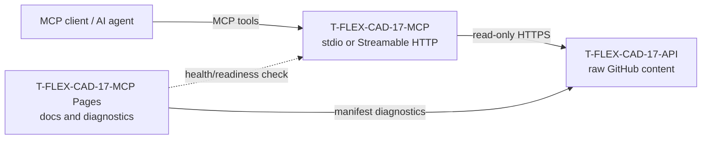

# T-FLEX CAD 17 MCP

Read-only Model Context Protocol server over the canonical [`T-FLEX-CAD-17-API`](https://github.com/KrickmanC/T-FLEX-CAD-17-API) knowledge/API layer.

[](https://render.com/deploy?repo=https%3A%2F%2Fgithub.com%2FKrickmanC%2FT-FLEX-CAD-17-MCP)

> GitHub Pages publishes only the static project dashboard. The executable MCP runtime is the Node.js/Docker service from this repository and must run on a compute host.

## Architecture



The runtime never modifies `T-FLEX-CAD-17-API`. It reads only the configured upstream base URL and allowlisted documentation paths.

## MCP tools

| Tool | Purpose |
|---|---|
| `tflex_manifest` | Return the dataset and graph manifests. |
| `tflex_search_symbols` | Search API symbols with optional assembly and kind filters. |
| `tflex_get_symbol` | Resolve an exact symbol identifier/name, then fall back to the best match. |
| `tflex_search_docs` | Search normalized CHM/help topic records. |
| `tflex_search_capabilities` | Search the curated capability-to-symbol/topic seed. |
| `tflex_get_document` | Read an allowlisted Markdown, CHM mirror, XML API, graph or manifest file. |

All tools are declared read-only and idempotent.

## Runtime endpoints

When `npm start` or the Docker image is running:

- MCP: `POST/GET/DELETE /mcp`
- Liveness: `GET /healthz`
- Upstream readiness: `GET /readyz`
- Service metadata: `GET /`

The HTTP transport maintains MCP sessions in process memory and returns `MCP-Session-Id` after initialization.

## Local stdio

```bash
npm install
npm run start:stdio
```

Example client configuration:

```json
{
  "mcpServers": {
    "t-flex-cad-17": {
      "command": "node",
      "args": ["/absolute/path/T-FLEX-CAD-17-MCP/src/stdio.js"]
    }
  }
}
```

## Local Streamable HTTP

```bash
npm install
npm start
```

Default endpoint:

```text
http://localhost:3000/mcp
```

The runtime also accepts platform-provided `PORT`; `MCP_PORT` takes precedence.

## Docker

```bash
docker build -t t-flex-cad-17-mcp .
docker run --rm -p 3000:3000 t-flex-cad-17-mcp
```

Or:

```bash
docker compose up -d --build
```

## Deploy to a public runtime

Deployment descriptors are included in the repository:

- `render.yaml` — Render Blueprint using the Docker runtime and `/healthz` health check.
- `railway.toml` — Railway Docker deployment with `/healthz` health check and restart policy.
- `compose.yaml` — VPS/on-premises Docker Compose deployment.
- `.github/workflows/container.yml` — publishes `ghcr.io/krickmanc/t-flex-cad-17-mcp:latest` and an immutable SHA tag.

After deployment, point the MCP client to:

```text
https://<runtime-host>/mcp
```

The GitHub Pages address is not the MCP endpoint.

## Configuration

| Variable | Default | Meaning |
|---|---:|---|
| `TFLEX_API_BASE_URL` | raw `T-FLEX-CAD-17-API/main` | Canonical read-only upstream. |
| `TFLEX_FETCH_TIMEOUT_MS` | `45000` | Upstream request timeout. |
| `TFLEX_CACHE_TTL_MS` | `300000` | In-memory dataset cache lifetime. |
| `TFLEX_MAX_DATASET_BYTES` | `67108864` | Maximum index response size. |
| `TFLEX_MAX_DOCUMENT_BYTES` | `2097152` | Maximum single document size. |
| `MCP_MAX_TOOL_OUTPUT_CHARS` | `120000` | Maximum serialized tool result. |
| `MCP_HOST` | `0.0.0.0` | HTTP bind address. |
| `MCP_PORT` | `3000` | HTTP port. |
| `PORT` | unset | Hosting-platform port fallback. |
| `MCP_ALLOWED_ORIGINS` | `*` | Comma-separated CORS origins. |

## Verification

```bash
npm run check
npm test
npm run smoke:live
```

CI checks JavaScript syntax, stdio MCP, Streamable HTTP MCP, the live knowledge/API layer, and the Docker image.

## GitHub Pages

`Deploy GitHub Pages` publishes the `site/` directory. The page reads the live manifests directly from `T-FLEX-CAD-17-API` and can probe `/healthz` and `/readyz` of a separately deployed runtime.

## Current canonical dataset

The current `T-FLEX-CAD-17-API` manifests report:

- 4 API assemblies
- 2,452 generated type pages
- 17,929 symbols
- 19,350 CHM/help pages
- 38,051 graph nodes
- 51,105 graph edges
