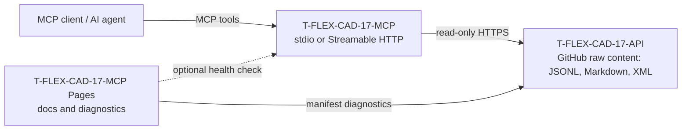

# T-FLEX CAD 17 MCP

Read-only Model Context Protocol server over the canonical [`T-FLEX-CAD-17-API`](https://github.com/KrickmanC/T-FLEX-CAD-17-API) knowledge/API layer.

> **Deployment boundary:** GitHub Pages is static hosting and cannot execute the Node.js MCP process. This repository therefore deploys a Pages documentation/diagnostics site, while the MCP runtime is started through `stdio`, Node.js HTTP, or Docker. The source dataset remains unchanged in `T-FLEX-CAD-17-API`.

## Architecture



The MCP server never modifies the API repository and does not accept arbitrary upstream URLs. It reads only the configured base URL and allowlisted documentation paths.

## MCP tools

| Tool | Purpose |
|---|---|
| `tflex_manifest` | Return the dataset and graph manifests. |
| `tflex_search_symbols` | Search API symbols with optional assembly and kind filters. |
| `tflex_get_symbol` | Resolve an exact symbol identifier/name, then fall back to best match. |
| `tflex_search_docs` | Search normalized CHM/help topic records. |
| `tflex_search_capabilities` | Search the curated capability-to-symbol/topic seed. |
| `tflex_get_document` | Read an allowlisted Markdown, CHM mirror, XML API, graph or manifest file. |

All tools are declared read-only and idempotent.

## Requirements

- Node.js 20.11 or newer; CI uses Node.js 22.
- Network access to the static API layer: `https://raw.githubusercontent.com/KrickmanC/T-FLEX-CAD-17-API/main/`.

## Local stdio server

```bash
npm install
npm run start:stdio
```

Example MCP client configuration:

```json
{
  "mcpServers": {
    "t-flex-cad-17": {
      "command": "node",
      "args": ["/absolute/path/T-FLEX-CAD-17-MCP/src/stdio.js"],
      "env": {
        "TFLEX_API_BASE_URL": "https://raw.githubusercontent.com/KrickmanC/T-FLEX-CAD-17-API/main/"
      }
    }
  }
}
```

## Streamable HTTP server

```bash
npm install
npm start
```

Default endpoints:

- MCP: `POST/GET/DELETE http://localhost:3000/mcp`
- Liveness: `GET http://localhost:3000/healthz`
- Upstream readiness: `GET http://localhost:3000/readyz`
- Service metadata: `GET http://localhost:3000/`

The HTTP implementation maintains MCP sessions in process memory. For horizontal scaling, use sticky sessions or a single replica unless a shared session store is added.

## Docker

```bash
docker build -t t-flex-cad-17-mcp .
docker run --rm -p 3000:3000 \
  -e TFLEX_API_BASE_URL=https://raw.githubusercontent.com/KrickmanC/T-FLEX-CAD-17-API/main/ \
  t-flex-cad-17-mcp
```

## Configuration

| Variable | Default | Meaning |
|---|---:|---|
| `TFLEX_API_BASE_URL` | Raw GitHub content URL | Canonical upstream base URL. |
| `TFLEX_FETCH_TIMEOUT_MS` | `45000` | Upstream request timeout. |
| `TFLEX_CACHE_TTL_MS` | `300000` | In-memory dataset cache lifetime. |
| `TFLEX_MAX_DATASET_BYTES` | `67108864` | Maximum index response size. |
| `TFLEX_MAX_DOCUMENT_BYTES` | `2097152` | Maximum single document size. |
| `MCP_MAX_TOOL_OUTPUT_CHARS` | `120000` | Maximum serialized tool result. |
| `MCP_HOST` | `0.0.0.0` | HTTP bind address. |
| `MCP_PORT` | `3000` | HTTP port. |
| `MCP_ALLOWED_ORIGINS` | `*` | Comma-separated CORS origins. |

## Verification

```bash
npm run check       # JavaScript syntax
npm test            # client, stdio MCP and Streamable HTTP MCP tests
npm run smoke:live  # live manifest, graph, capability and symbol index checks
```

CI performs all three checks and builds the Docker image. The protocol tests execute `tools/list` and `tools/call` over both standard transports against a deterministic fixture API.

## GitHub Pages

The `Deploy GitHub Pages` workflow publishes the `site/` directory. The page checks the live API and graph manifests in the browser and can probe `/healthz` and `/readyz` on a separately deployed MCP runtime.

## Dataset currently expected from the API layer

The canonical manifest generated on 2026-08-17 reports:

- 17 assemblies
- 2,452 types
- 17,929 symbols
- 19,350 CHM/help pages
- 21,558 graph nodes
- 45,821 graph edges

These values are verified dynamically by the live smoke test rather than embedded into server behavior.
